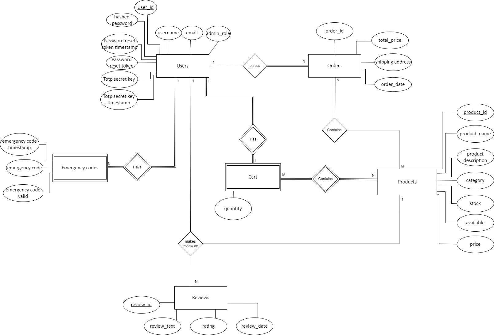
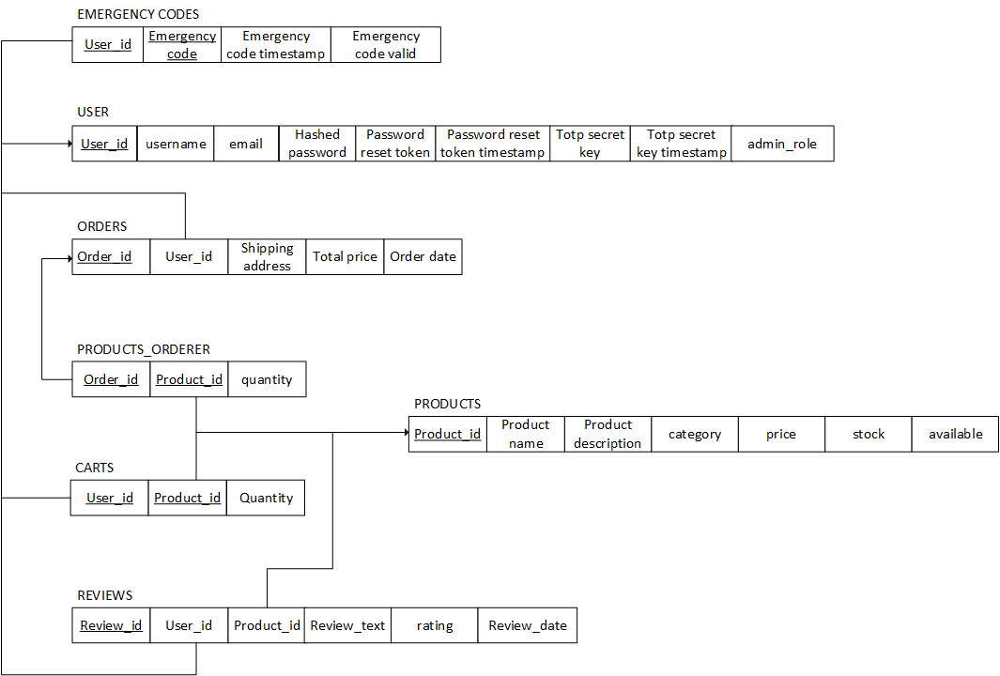

# BD: Trabalho Prático APF-T

**Grupo**: P2G3
- Tiago Fonseca, MEC: 107266
- João Gaspar, MEC: 114514

---

The files should be organized with the following nomenclature:

- sql\01_ddl.sql: mandatory for DDL
- sql\02_sp_functions.sql: mandatory for Store Procedure, Functions,... 
- sql\03_triggers.sql: mandatory for triggers
- sql\04_db_init.sql: scripts to init the database (i.e. inserts etc.)
- sql\05_any_other_matter.sql: any other scripts.

Por favor remova esta secção antes de submeter.

Please remove this section before submitting.

# Introduction
 
Online merchandising shop that implements a database, interactable through the front-end.
There will be one main entity, the `Users`:

* After a `User` creates an account, in order to protect the account in case the he looses access to the account or to the 2-step authentication, he can recover the account using one of the N associated `emergency_codes` that will verify that the `User` is indeed the owner of the account
* `Users` will have one `cart` that is `User` specific.
* Each `cart` contains N `products` and each `products` can be in `carts` from M different `Users`.
* After a `User` buys products from a cart, an `order` will be placed. Each `order` is associated to a `User` and N `products`
* `Users` will also be able to make N `reviews` on one `product`, each `review` will have only one writer.

# Features
- Save your cart for later
- Effortlessly buy merchandise from the LECI students center
- Make your opinion count and add a rating or comment to the products you buy or wish to buy
- Stay on top of your orders by simply checking your orders page, you can rebuy from any past order you have

# Requirements

### Functional

* #### Users
  * Create an account with a persistent cart
  * Add and remove products to cart
  * Complete orders
  * Edit account information
  * See previous orders
  * Review bought products
  * Filter and search for products
* #### Administrators
  * Add and remove products to the shop
  * Edit products data
  * See current selling products on shop
  * Process and/or delete orders
  * See shop statistics

### Non Functional

* #### Security
  * Provide 2FA and Emergency Codes for Users, securing the Authentication process and the respective accounts
* #### Performance
  * The shop must be quick and have a short response time
* #### Reliability
  * It must persist during and after issues, maintaining the integrity of critical information
* #### Ease-of-Use
  * It should be intuitive and accessible for everyone to use

# DER - Entity Relationship Diagram

### Versão final/Final version



### APFE 

No improvements were made following the APFE assignment. The database design was appropriate and aligned with the requirements necessary to build the application.

# ER - Esquema Relacional/Relational Schema

### Versão final/Final Version



### APFE

No improvements were made following the APFE assignment. The database design was appropriate and aligned with the requirements necessary to build the application.

# ​SQL DDL - Data Definition Language

[SQL DDL File](sql/01_ddl.sql "SQLFileQuestion")

# SQL DML - Data Manipulation Language

Uma secção por formulário.
A section for each form.

### Example Form


```sql
-- Show data on the form
SELECT * FROM MY_TABLE ....;

-- Insert new element
INSERT INTO MY_TABLE ....;
```

...

# Normalization

Descreva os passos utilizados para minimizar a duplicação de dados / redução de espaço.
Justifique as opções tomadas.
Describe the steps used to minimize data duplication / space reduction.
Justify the choices made.

# Indexes

Descreva os indices criados. Junte uma cópia do SQL de criação do indice.
Describe the indexes created. Attach a copy of the SQL to create the index.

```sql
-- Create an index to speed
CREATE INDEX index_name ON table_name (column1, column2, ...);
```

# SQL Programming: Stored Procedures, Triggers, UDF

[SQL SPs and Functions File](sql/02_sp_functions.sql "SQLFileQuestion")

[SQL Triggers File](sql/03_triggers.sql "SQLFileQuestion")

# Other notes

## GitHub Repository

This project was developed using GitHub, this is our [GitHub Repository](https://github.com/tiagosf13/BD-Project/tree/main)

# Database init data

[Indexes File](sql/01_ddl.sql "SQLFileQuestion")

# Presentation

[Slides](Apresentação.pdf)

[Video](https://uapt33090-my.sharepoint.com/:v:/g/personal/t_fonseca_ua_pt/EXb6lB6GSGZPo3uJjZEqt-4BAtolnn_I06x7exbqrrPkDg?e=QKuHpa)


 