# BD: Trabalho Prático APF-T

**Grupo**: P2G3

- Tiago Fonseca, MEC: 107266
- João Gaspar, MEC: 114514

---

# Introduction

Online merchandising shop that implements a database, interactable through the front-end.
There will be one main entity, the `Users`:

* After a `User` creates an account, to protect the account in case he loses access to the account or to the 2-step authentication, he can recover the account using one of the N associated `emergency_codes` that will verify that the `User` is indeed the owner of the account
* `Users` will have one `cart` that is `User` specific.
* Each `cart` contains N `products` and each `products` can be in `carts` from M different `Users`.
* After a `User` buys products from a cart, an `order` will be placed. Each `order` is associated to a `User` and N `products`
* `Users` will also be able to make one `review` on one `product`, but they can have N `reviews` on N `products`.
# Features

- Save your cart for later
- Effortlessly buy merchandise from the LECI students center
- Make your opinion count and add a rating or comment to the products you buy or wish to buy
- Stay on top of your orders by simply checking your orders page, you can rebuy from any past order you have

# Requirements

### Functional

* #### Users

  * Create an account with a persistent cart
  * Add and remove products to cart
  * Complete orders
  * Edit account information
  * See previous orders
  * Review bought products
  * Filter and search for products
* #### Administrators

  * Add and remove products to the shop
  * Edit products data
  * See current selling products on shop
  * Process and/or delete orders
  * See shop statistics

### Non Functional

* #### Security

  * Provide 2FA and Emergency Codes for Users, securing the Authentication process and the respective accounts
* #### Performance

  * The shop must be quick and have a short response time
* #### Reliability

  * It must persist during and after issues, maintaining the integrity of critical information
* #### Ease-of-Use

  * It should be intuitive and accessible for everyone to use

# DER - Entity Relationship Diagram

### Final version

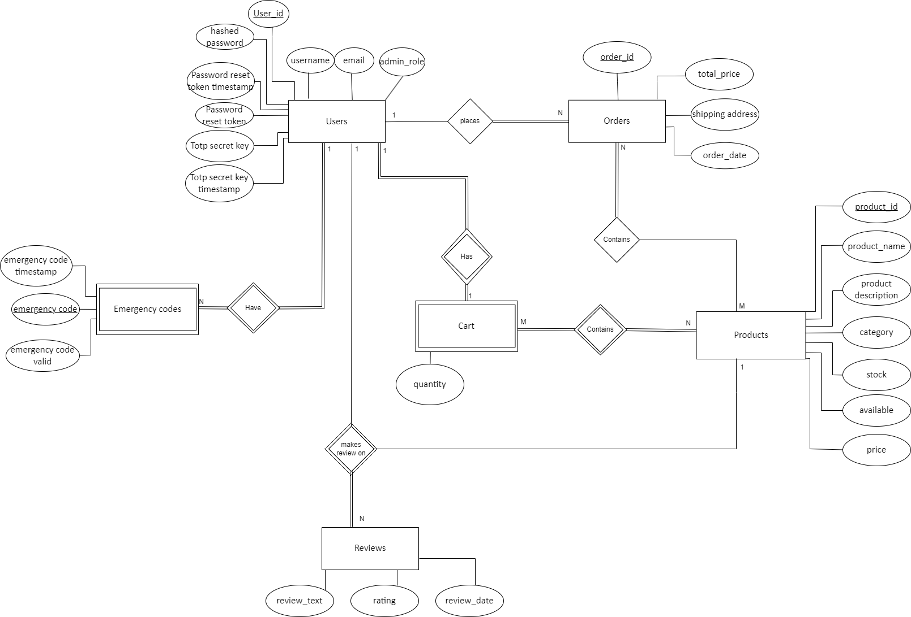

### APFE

Following the APFE assignment only one change was made: Dropped review_id column from table reviews, a user_id alongside with product_id were made the primary key of the table, and as this change made `Reviews` a weak entity, we represented this change in DER.

# ER - Relational Schema

### Final Version

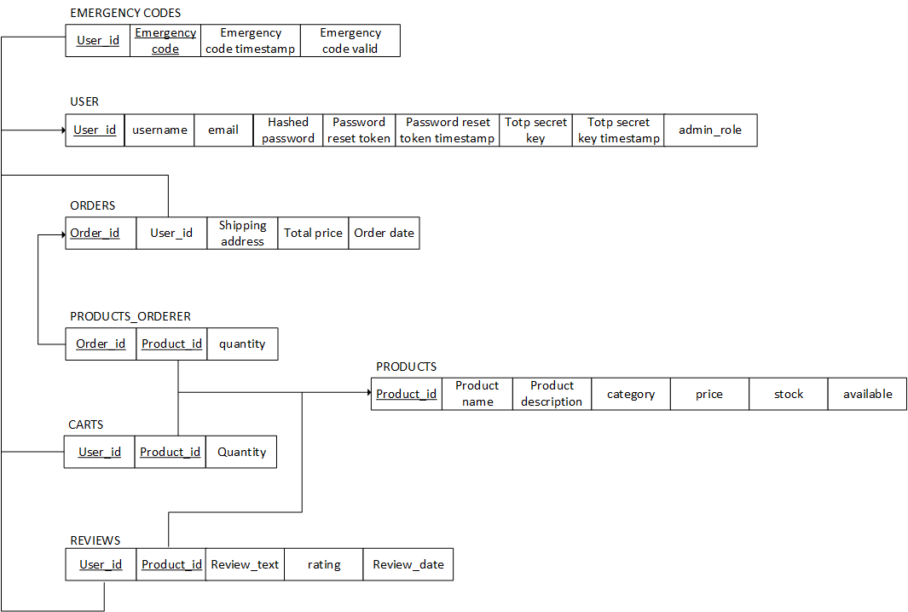

### APFE

Following the APFE assignment only one change was made: Dropped review_id column from table reviews, a user_id alongside with product_id were made the primary key of the table.

# SQL DDL - Data Definition Language

[SQL DDL File](sql/01_ddl.sql "SQLFileQuestion")

# SQL DML - Data Manipulation Language

### Form 1

Setting the Number of Units to 0 results in the product being out of stock, thereby being set as Unavailable

```sql
-- Make a product unavailable, removing it from any cart and marking it as unavailable --
-- ProductManagement:remove_product --
DELETE FROM carts WHERE product_id = ?;
UPDATE products SET available = 0 WHERE product_id = ?;
```

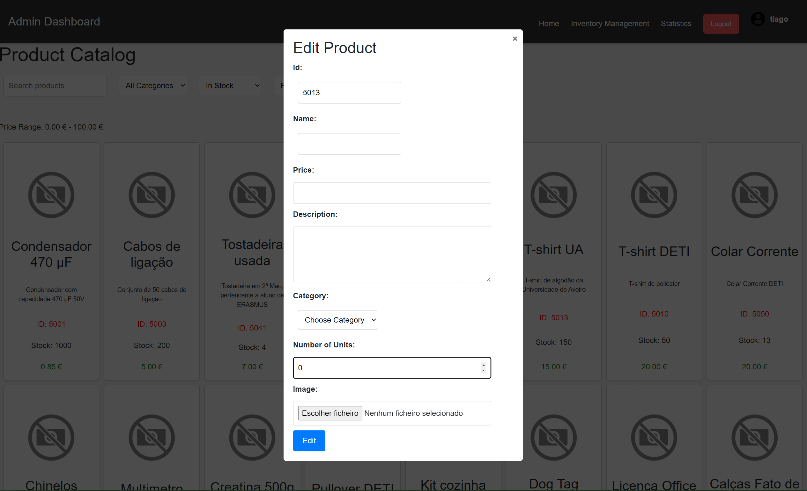

### Form 2

When we have a product in the Cart with `X` quantity, if we remove the exact `X` quantity of that product from the Cart, the product is eliminated from it

```sql
-- Remove a product from the cart --
-- ProductManagement:remove_product_from_cart --
DELETE FROM carts WHERE product_id = ? AND user_id = ?;
```

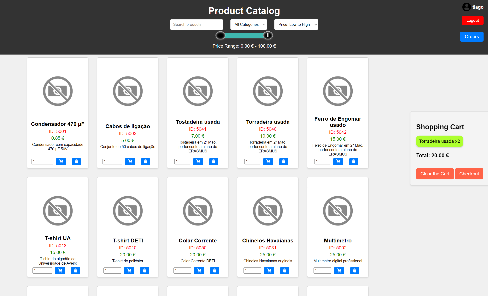

### Form 3

When clicking in the option *Clear the Cart*, all the products that are present there are removed from the Cart

```sql
-- Remove all products from the cart --
-- ProductManagement:remove_all_products_from_cart --
DELETE FROM carts WHERE user_id = ?;
```


### Form 4

Registering a new order, creating the order and then adding the products ordered

```sql
-- Register an order, creating the order and then adding the products ordered --
-- OrderManagement:register_order --

INSERT INTO orders (order_id, user_id, total_price, shipping_address, order_date)
VALUES (?, ?, ?, ?, ?);

INSERT INTO products_ordered (order_id, product_id, quantity)
VALUES (?, ?, ?);
```

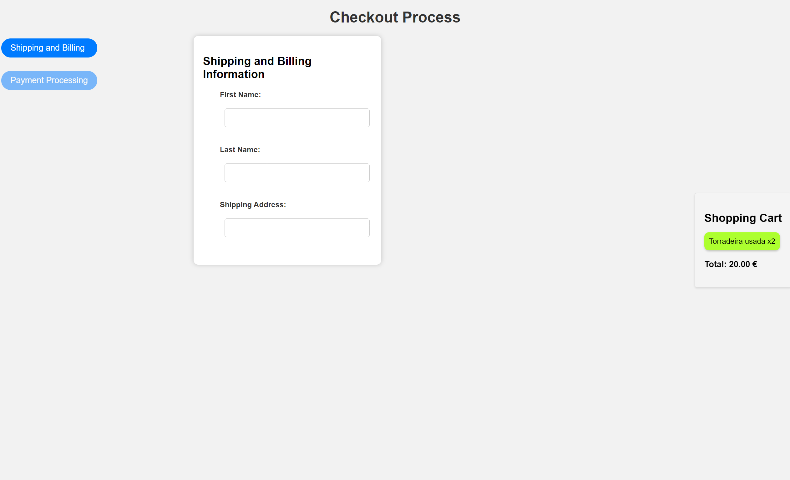

### Form 5

Creating a new product

```sql
-- Insert a product --
-- ProductManagement:create_product --
INSERT INTO products (product_id, product_name, product_description, price, category, stock, available)
VALUES (?, ?, ?, ?, ?, ?, ?);
```

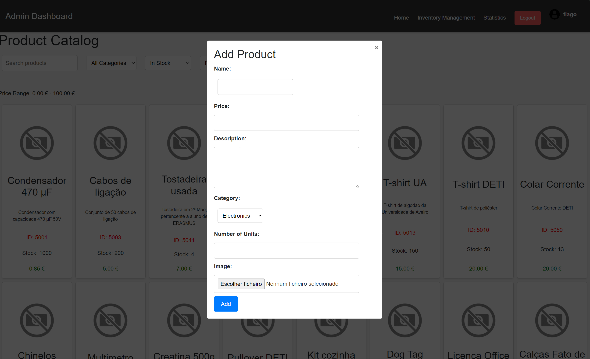

### Form 6

Creating a new user

```sql
-- Register a new user --
-- UserManagement:create_user --
INSERT INTO users (user_id, username, hashed_password, email, totp_secret_key, totp_secret_key_timestamp, admin_role) VALUES (?, ?, ?, ?, ?, ?, ?);
```

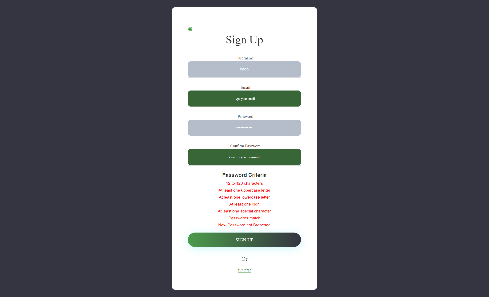

### Form 7

Get the Products, their respective quantity in the Cart and the total price for the respective item, this is only used to send the receipt of the purchase via email

```sql
-- Get the Products, their quantity in the Cart and the total price for that item, based on the User ID --
-- EmailHandler:sql_to_pdf --
SELECT carts.product_id, carts.quantity, products.product_name, products.price, carts.quantity * products.price AS total
FROM carts
    JOIN products ON carts.product_id = products.product_id
WHERE carts.user_id = ?;
```

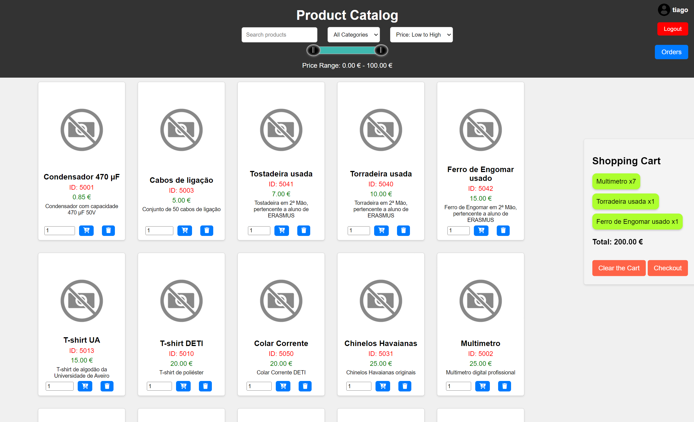

### Form 8

Get the products that correspond to the given filters used by the client, first for a regular client, second to a admin

```sql
-- Get the products that correspond to the given filters used by the client, first for a regular client, second to a admin --
-- We used wildcars --
-- search_term = f"%{search_term}%" --
-- category = f"%{category}%" --
-- Retrievers:get_all_products --

SELECT *
FROM searchAvailableProducts (?, ?, ?, ?)
ORDER BY price {sort_order};

SELECT *
FROM products
WHERE (product_name LIKE ? OR product_id LIKE ?)
    AND category LIKE ?
    AND price BETWEEN ? AND ?
    AND available = ?
ORDER BY price {sort_order};
```


### Form 9

Get the monthly sales

```sql
-- Get the monthly sales --
-- Retrievers:get_monthly_sales --
SELECT * FROM getMonthlySalesTable(?, ?);
```

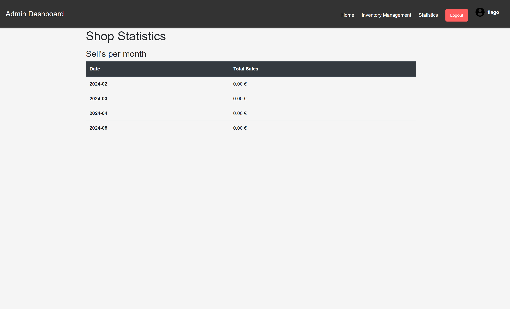

### Form 10

In order for the user to add a review to a product, he needs to buy that product first

```sql
-- Check if a user bought a product --
-- UserManagement:check_user_bought_product --
SELECT products_ordered.order_id
FROM products_ordered
    JOIN orders ON products_ordered.order_id = orders.order_id
WHERE orders.user_id = ? AND products_ordered.product_id = ?;
```

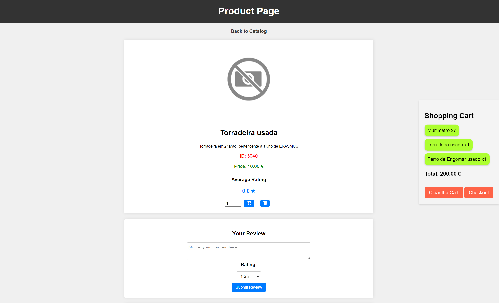
# Normalization

To avoid redundancy in the relationship `Orders contains Products`, we created an auxiliary table `Products Ordered`, thereby ensuring adherence to the Third Normal Form (3NF) instead of placing all information within a single table.

Also, on the table `Reviews`, `product_id` alongside `user_id` would uniquely define review_id, violating the 3rd normal form, so in order to prevent that from happening, a normalization on that table was made, removing the column `review_id` from the column and promoting the candidate key (`user_id`, `product_id`) to a primary key fixed the issue and setting the table to respect 3FN.

Additionally, beyond the normalization mentioned, we designed the database with normal forms in mind from the outset. This approach enabled us to achieve a cleaner database design and minimize the number of NULL entries in the tables.

# Indexes

To enhance the search efficiency within our tables, we created indexes in addition to the automatically generated clustered indexes for primary keys. We selected columns that are frequently searched.

For the `Orders` table, we created an index on `user_id` to expedite the process of retrieving a user's purchase history.

In the `Products` table, we established two indexes: one for product names and another for categories, as searches on the website are primarily focused on these two attributes.

For the `Reviews` table, we created an index on `product_id` because reviews are displayed to users on the specific product's page.

Lastly, to optimize user searches by name, we created an index on the `name` column in the `Users` table.

```sql
-- Optimizar search de user_id
CREATE INDEX IX_orders_user_id ON orders(user_id)

-- otimizar search de product_id, product_name, product_category
CREATE INDEX IX_products_product_name ON products(product_name)
CREATE INDEX IX_products_product_category ON products(category)

-- otimizar search de product_id
CREATE INDEX IX_reviews_product_id ON reviews(product_id)

-- otimizar search de user_id e username
CREATE INDEX IX_users_username ON users(username)
```
After creating the index's we compared search times on the table `Products` and got the following results which show that index's improved search times even for a small amount of data, which show the importance of creating the chosen index's
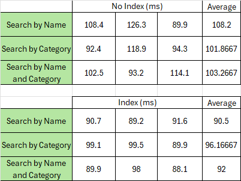

# SQL Programming: Stored Procedures, Triggers, UDF

[SQL SPs and Functions File](sql/02_sp_functions.sql "SQLFileQuestion")

[SQL Triggers File](sql/03_triggers.sql "SQLFileQuestion")

# Other notes

### Forms

There are many other forms, we only logged 10 in this report in order to not occupy too many space. If you wish to view all of them, you can see them [here](https://github.com/tiagosf13/BD-Project/tree/main/Second%20Assignment/src/queries/DML), or just by reviewing the [code](https://github.com/tiagosf13/BD-Project/tree/main/Second%20Assignment/src).

### GitHub Repository

This project was developed using GitHub, this is our [GitHub Repository](https://github.com/tiagosf13/BD-Project/tree/main)

### Using your Database

To use your database, follow these steps:
1. Create a new database in your SQL server.
2. Open the `DataBaseCredentials.json` file:
	1. Change the `host` variable to your database URI.
	2. Change the `dbname` variable to your database name.
	3. Change the `user` variable to your database username.
	4. Change the `password` variable to your database password.

# Database init data

[SQL Initial Data File](sql/04_db_init.sql "SQLFileQuestion")

# Presentation

[Slides](Apresentação.pdf)

[Link Video](https://uapt33090-my.sharepoint.com/:v:/g/personal/t_fonseca_ua_pt/EXb6lB6GSGZPo3uJjZEqt-4BAtolnn_I06x7exbqrrPkDg?e=QKuHpa)