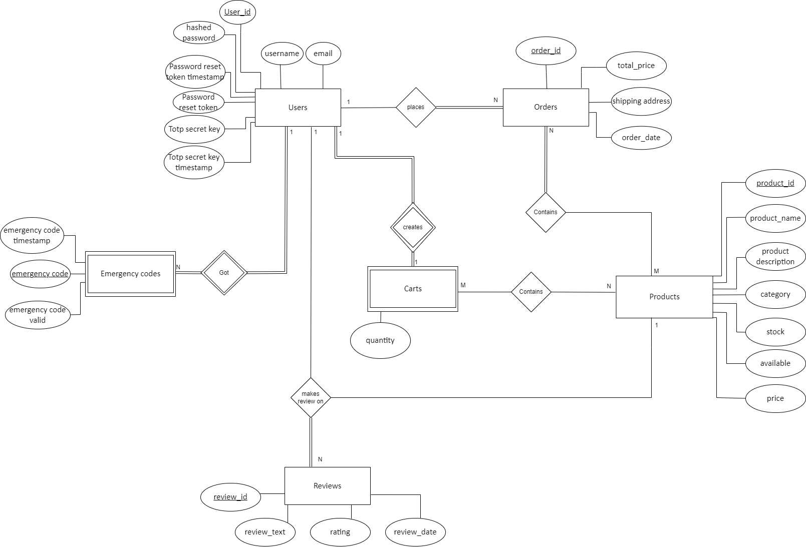
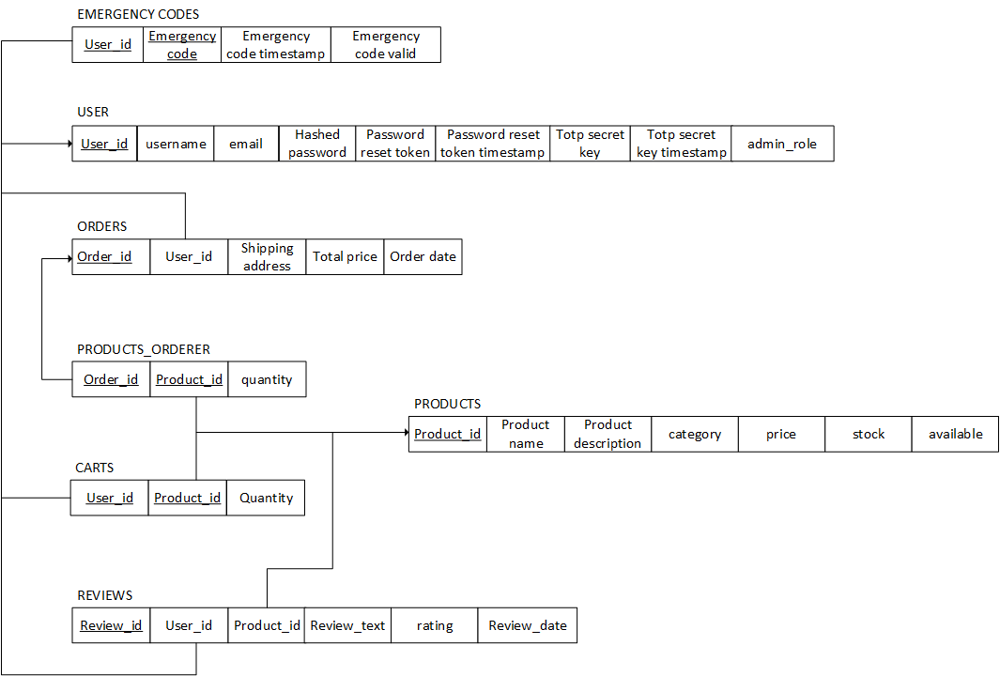

# BD: Trabalho Prático Loja (?)

**Grupo**: P2G3
- Tiago Fonseca, MEC: 107266
- João Gaspar, MEC: 114514

## Introduction

[Explicar a app]

## Features

- Save your cart for later
- Effortlessly buy merchandise from the LECI students center
- Make your opinion count and add a rating or comment to the products you buy or wish to buy
- Stay on top of your orders by simply checking your orders page, you can rebuy from any past order you have

## Requirements

### Functional

* #### Users
    * Create an account with a persistent cart
    * Add and remove products to cart
    * Complete orders
    * Edit account information
    * See previous orders
    * Review bought products
    * Filter and search for products

* #### Administrators
    * Add and remove products to the shop
    * Edit products data
    * See current selling products on shop
    * Process and/or delete orders
    * See shop statistics

### Non Functional

* 

## Entities

* carts
* emergency_codes
* orders
* products
* reviews
* users

##  Relations

* users - orders [1:N]
* users - emergency_codes [1:N]
* users - carts [1:1]
* users - reviews [1:N]
* orders - products [N:M]
* carts - products [N:M]
* reviews - products [N:1]

## Entity attributes

#### carts

* user_id **[PK] [FK]**
* product_id **[PK] [FK]**
* quantity **[PK]**

#### emergency_codes

* user_id **[PK] [FK]**
* emergency_code **[PK]**
* emergency_code_valid
* emergency_code_timestamp

#### orders

* order_id **[PK]**
* user_id **[PK] [FK]**
* total_price
* shipping_address
* order_date

#### products_Ordered

* order_id **[PK] [FK]**
* product_id **[PK] [FK]**
* quantity

#### products

* product_id **[PK]**
* product_name
* product_description
* price
* category
* stock
* available

#### reviews

* review_id **[PK]**
* product_id **[FK]**
* user_id **[FK]**
* review_text
* rating
* review_date

#### users

* user_id **[PK]**
* username
* hashed_password
* password_reset_token
* password_reset_token_timestamp
* email
* totp_secret_key
* totp_secret_key_timestamp
* admin_role

## DER

## ER

